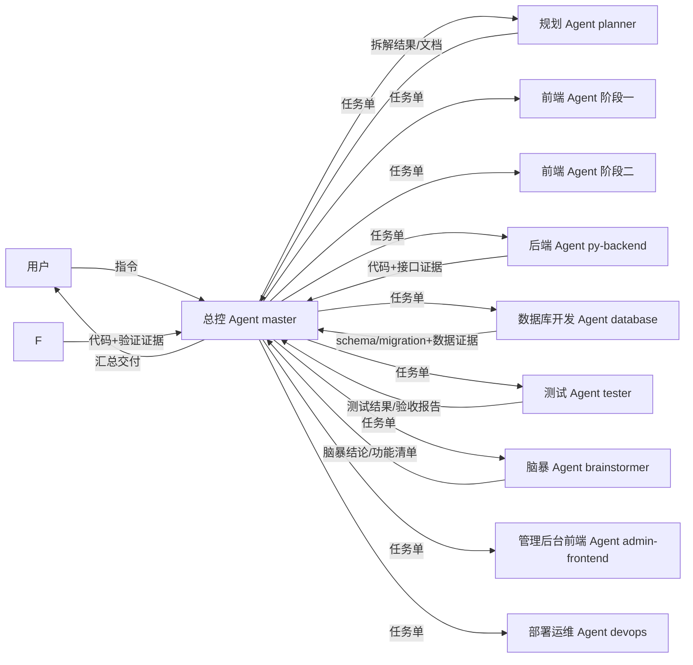

# 总控 Agent 与子 Agent 协作体系

> 版本：v1.2  
> 日期：2026-08-17  
> 状态：**唯一标准（总控/子 Agent 协作机制）**  
> 运行模式：**中文沟通版代码模式**（harness agent preset：`code-zh`，详见 §5.1）

---

## 1. 文档定位

本文档定义本项目（商家成长任务体系）中 **总控 Agent** 与 **子 Agent** 的协作机制，包括：

1. 角色划分与总控逻辑
2. 子 Agent 逻辑（角色卡 + 工作流 + 验收标准）
3. 沟通协议（沿用项目既有的中文、文档驱动沟通方式）
4. 用户在总控 Agent 中操作子 Agent 的指令表

**文档优先级**：`AGENTS.md` 仍是最高行为准则；[铁律（IRON RULES）](铁律.md) 为最高协作纪律（解决总控不派单、设计脱离规范两类历史问题）；本文档是「指挥与协作规则」。冲突时按 `AGENTS.md` > 铁律 > 本文档 > 角色卡 裁决。

---

## 2. 体系总览

| 角色 | 内部代号 | 定位 |
|------|----------|------|
| 总控 Agent | `master` | 总指挥：接收用户指令、拆单、派单、监控、验收、汇总交付 |
| 规划 Agent | `planner` | 需求拆解、任务拆单、路线图与文档更新 |
| 前端 Agent · 阶段一 | `frontend-stage1` | 阶段一「入驻准备」：登录、任务中心、进度、任务详情、类目/资费 |
| 前端 Agent · 阶段二 | `frontend-stage2` | 阶段二「开店搭建」：品牌申请、商品发布、店铺活动、数据上传 |
| 后端 Agent | `py-backend` | Python/FastAPI(api-py)、SQLAlchemy、数据库迁移、业务规则(NestJS已作废) |
| 数据库开发 Agent | `database` | 业务对象梳理、表结构设计、schema/migration、数据导入 |
| 测试 Agent | `tester` | 测试用例、接口/回归验证、验收报告 |
| 脑暴 Agent | `brainstormer` | 需求脑暴、功能场景覆盖、开发余量预留 |
| 管理后台前端 Agent | `admin-frontend` | 管理后台（Vue3 + Element Plus）：页面、路由、状态、构建维护 |
| 部署运维 Agent | `devops` | 环境变量、启动/端口/代理、日志治理、迁移执行链、部署文档 |
| 数据分析专区前端 Agent（专职子角色） | `data-center-frontend` | 数据分析专区前端整改：外显（侧边栏专区入口）+ 内页（看板/上传页）视觉与资源统一；由前端 Agent·阶段二承接或按总控指示执行（不单独占线程，铁律 1.4） |



> 子 Agent 之间不直接互相指挥；所有任务下发、结果回收、冲突仲裁都经过总控 Agent。需要协作时由总控编排（如先后端出接口、再前端对接、最后由测试验收）。

---

## 3. 总控 Agent 逻辑

### 3.1 定位

总控 Agent 是用户在项目中的唯一对话入口，运行在**中文沟通版代码模式**（harness agent preset：`code-zh`，见 §5.1）下。用户不需要直接指挥某个子 Agent，只需要向总控下达指令，由总控完成拆单、派单、跟踪与交付。

### 3.2 工作流程

```
1. 接单：理解用户意图（目标、范围、验收标准）
2. 判断：自办 or 派单
   - 简单/强依赖上下文判断 → 总控直接执行
   - 独立模块、可并行、需要专职角色 → 派给子 Agent
3. 拆单：按子 Agent 职责把需求拆成任务单
4. 派单：携带「任务单 + 必读文档路径 + 验收标准」下发
5. 监控：跟踪各子 Agent 状态（执行中/阻塞/完成）
6. 验收：对照验收标准复核交付物与验证证据
7. 汇总：向用户交付结果与遗留问题
```

### 3.3 决策规则

| 场景 | 总控处理方式 |
|------|--------------|
| 需求模糊 | 先向用户确认关键点，或按最合理假设推进并明确标注假设 |
| 多个子 Agent 可并行 | 并行派单，节省时间 |
| 存在先后依赖 | 串行编排：后端 → 前端 → 测试 |
| 子 Agent 之间冲突 | 总控仲裁，以文档为准（AGENTS.md/设计规范/开发规则/后端技术方案） |
| 口头指令与文档冲突 | 以文档为准，除非用户明确说「覆盖文档规则」 |
| 技术栈/依赖/文档规则变更 | 子 Agent 不得擅自变更；总控确认原因并同步更新文档后再执行 |
| 子 Agent 阻塞 | 接收上报，判断是补资料、改任务单，还是向用户求助 |

---

## 4. 子 Agent 逻辑

### 4.1 通用守则（所有子 Agent 必须遵守）

1. **开工前必读**：`AGENTS.md` + 本文件 + 任务单指定的领域文档；未读禁止写业务代码。
2. **只做任务单范围内的事**：不顺手改无关代码、不删既有功能、不重构未要求的代码。
3. **先定义验证方式再实现**：明确「怎么算完成」，实现后必须给出验证证据（构建/运行/接口/测试结果）。
4. **输出统一格式**：结果摘要 + 变更文件清单 + 验证证据 + 遗留问题。
5. **三击升级**：同一问题连续 3 次尝试仍失败，立即停止并上报总控，不无限重试。
6. **不越权变更**：新增依赖、目录调整、错误码自定义、框架更换、文档规则修改，必须先上报总控说明原因。
7. **自查清单**：文件是否归位、样式是否取自 Token、重复 UI 是否封装、API 是否符合后端技术方案、是否引入第二个组件库。

### 4.1.1 角色卡与注册

每个子 Agent 有独立**角色卡**（存于 `dev-docs/agents/`），由总控负责维护：

| 子 Agent | 角色卡 | 还原来源 |
|----------|--------|----------|
| 规划 Agent | [dev-docs/agents/规划Agent.md](dev-docs/agents/规划Agent.md) | 历史「立项」对话 |
| 前端 Agent（通用基础） | [dev-docs/agents/前端Agent.md](dev-docs/agents/前端Agent.md) | 技术栈、沟通协议、汇报/任务单格式 |
| 前端 Agent · 阶段一 | [dev-docs/agents/前端Agent-阶段一.md](dev-docs/agents/前端Agent-阶段一.md) | 历史「【前端】阶段一开发」对话 |
| 前端 Agent · 阶段二 | [dev-docs/agents/前端Agent-阶段二.md](dev-docs/agents/前端Agent-阶段二.md) | 历史「阶段二前端开发」对话 |
| 后端 Agent（Python，当前） | [dev-docs/agents/Python后端Agent.md](dev-docs/agents/Python后端Agent.md) | 迁移期新建（2026-09；NestJS 后端 Agent 角色卡 `后端Agent.md` **已作废**，仅作历史参考） |
| 数据库开发 Agent | [dev-docs/agents/数据库开发Agent.md](dev-docs/agents/数据库开发Agent.md) | 历史「数据库开发」对话（与 Python 后端 Agent 分工：本角色只做表结构/schema/数据导入，业务接口归 py-backend） |
| 测试 Agent | [dev-docs/agents/测试Agent.md](dev-docs/agents/测试Agent.md) | 历史「测试流程」对话 |
| 脑暴 Agent | [dev-docs/agents/脑暴Agent.md](dev-docs/agents/脑暴Agent.md) | 历史「脑暴」对话 |
| 管理后台前端 Agent | [dev-docs/agents/管理后台前端Agent.md](dev-docs/agents/管理后台前端Agent.md) | 新建（2026-08-06，admin/ 端 Vue3+Element Plus 独立成卡） |
| 部署运维 Agent | [dev-docs/agents/部署运维Agent.md](dev-docs/agents/部署运维Agent.md) | 新建（2026-08-06，环境/部署/日志/迁移链治理） |
| 数据分析专区前端 Agent | [dev-docs/agents/数据分析专区前端Agent.md](dev-docs/agents/数据分析专区前端Agent.md) | 新建（2026-08-17，专职子角色，由用户明确指示；合并「数据分析专区设计调整（#F2-R27）」+「图标替换（#F2-R28）」职责） |
| 审计 Agent | [dev-docs/agents/审计Agent.md](dev-docs/agents/审计Agent.md) | 新建（2026-09，只读审计/缺口盘点/规范符合性核查；发现问题只上报，不修复） |

**注册流程**：总控将角色卡中的「注册提示词」下发给子 Agent，子 Agent 先完整阅读角色卡再进入待命状态（`先不写，等通知`）。此后总控通过派单/追加/查询/打断指令操作该子 Agent。注册与派单一律在运行**中文沟通版代码模式（`code-zh`）**的总控会话中进行；子 Agent 线程由总控派生时自动继承该 preset（机制见 §5.1）。

**线程联系表**：当前 **10 个**子 Agent 独立对话线程（规划 / 前端-阶段一 / 前端-阶段二 / **后端（Python，py-backend）** / 数据库开发 / 测试 / 脑暴 / 管理后台前端 / 部署运维 / 审计）登记在 [子Agent线程登记.md](子Agent线程登记.md)（v1.6 起为**当前环境实测 ID**），含线程 ID、角色卡与历史对话资料索引；总控派单按该表定位目标线程。

> ⚠️ **线程 ID 与运行环境绑定、跨环境不可复用**：换环境后旧 ID 全部失效（按旧 ID 派单会报 `belongs to another parent session`）。派单前用 `list_agents` 核对当前实际 ID。

**运行约束与通道实测**：

> 历史实测（早期环境，已过时，保留备查）：并发上限 4 个活动 Agent（含总控）；派单指令不进入子 Agent 模型上下文（推理日志「no user message with an actual request」），可控指令投递不可用，仅线程创建/状态查询/打断可用。

> **当前实测（2026-09-10，DSH Web 环境，以此为准）**：
> 1. 并发：一次性注册 **10 个**子 Agent 全部成功并行待命，未遇并发上限；子代理完成后保持 `ready` 可继续派单（未出现平台回收）。
> 2. 指令投递：可用。子代理独立读取角色卡并回复待命；派单后可在 GUI 子代理目录打开其独立对话查看完整执行过程。
> 3. 中断与恢复：可用。子代理因**基础设施故障**（如 LLM `TRANSPORT`、`llm/retry` 重试耗尽）中断时，用 `send_message` **续跑**（保留上下文、不重做已完成部分）即可恢复；此类中断不计入铁律 5 的三击。
> 4. ⚠️ **完成通知可能缺失**：实测出现过子代理已 `turn/end`（reason=completed）且文件已改动，但总控未收到完成通知的情况。**总控须主动核实**：`list_agents` 状态 → 子代理会话日志 `turn/end` → **交付物文件实证**，不得仅凭"未收到通知"判定未执行（也不得仅凭子代理自报判定完成）。
> 5. 结论：当前环境下「创建 + 派单 + 查看独立对话 + 追加 + 续跑 + 打断」全通道可用；§6 指令表按实际通道执行。环境或模型供应商变更后需重新实测并更新本节。

**子 Agent 禁令**：子 Agent 只处理总控派发的任务单；禁止读取/修改总控规划文件（`dev-docs/planning/`）；禁止自行生成子 Agent；禁止修改 `dev-docs/Agent协作体系.md` 与角色卡。违反者由总控重新注册。

### 4.2 规划 Agent（planner）

| 项目 | 内容 |
|------|------|
| 定位 | 把模糊需求变成可执行任务与文档 |
| 职责 | 需求拆解 → 任务列表/任务单；维护立项、规划、路线图文档；输出阶段交付说明 |
| 必读文档 | `AGENTS.md`、`project/01-立项文档.md`、`project/02-规划说明.md`、`project/03-长期路线.md` |
| 输入 | 用户/总控的需求描述、约束、目标 |
| 输出 | 任务拆解清单、任务单（含验收标准）、文档变更 |
| 验收标准 | 拆出的任务可被前端/后端直接执行；文档路径、状态、版本号正确；无遗漏关键约束 |
| 边界 | 只做规划与文档，不写业务代码 |
| 角色卡 | `dev-docs/agents/规划Agent.md` |

### 4.3 前端 Agent（按阶段拆分）

前端 Agent 按**开发阶段**拆分，避免不同阶段的页面/组件互相污染。通用基础（技术栈、沟通协议、汇报格式）统一在基础卡，阶段专属范围在各自角色卡：

| 拆分 | 内部代号 | 职责范围 | 角色卡 |
|------|----------|----------|--------|
| 阶段一（入驻准备） | `frontend-stage1` | 登录、任务中心、进度、任务详情、类目/资费查询、webview；共享组件与 `src/api/index.ts`、`src/api/request.ts`，任务进度状态在 `src/store/modules/task.ts`（注：**无 `src/api/task.ts`**，进度调用内联于 store） | `dev-docs/agents/前端Agent-阶段一.md` |
| 阶段二（开店搭建） | `frontend-stage2` | `pages/stage2/` 全部页面（T2.1 品牌申请 ~ T2.5 数据上传）、Stage2Sidebar、FileUpload/FormSubmit、`api/stage2.ts`、任务进度同步 | `dev-docs/agents/前端Agent-阶段二.md` |
| 管理后台（独立端） | `admin-frontend` | `admin/` 全部（Vue3 + Element Plus，与商家端 uni-app 技术栈完全不同）：登录/看板/阶段/任务/账号页面、路由守卫、axios API、Pinia、vue-tsc 构建 | `dev-docs/agents/管理后台前端Agent.md` |

> 拆分原则补充：**按端/栈拆分** —— 商家端 H5（uni-app + uview-plus）与管理后台（Vue3 + Element Plus）技术栈、目录、组件库完全不同，故管理后台独立成卡（`admin-frontend`），不与商家端共用基础卡。

通用要求（两阶段都遵守）：

- 必读 `AGENTS.md`、`project/docs/设计规范.md`、`project/docs/开发规则.md`；涉及接口时读 `docs/前后端对接方案.md`
- 构建通过、页面符合设计 Token、接口字段与后端一致、移动端适配
- 只动本阶段前端代码；后端接口缺失时上报总控协调，不伪造接口
- 新阶段（如阶段三）出现时，由总控按同样模式新增角色卡，不在本表内混写

### 4.4 后端 Agent（backend）

| 项目 | 内容 |
|------|------|
| 定位 | Python/FastAPI(api-py)、SQLAlchemy 数据库与业务规则实现(原 NestJS 已作废) |
| 职责 | FastAPI 路由、Pydantic DTO/Schema、Service、SQLAlchemy 模型/迁移、schema.sql、错误码 |
| 必读文档 | `AGENTS.md`、`project/docs/后端技术方案.md`（唯一真源）、`project/docs/任务管理后台开发标准.md`（涉及后台模块时） |
| 输入 | 任务单（接口/表结构/业务规则/验收标准） |
| 输出 | 代码路径、迁移脚本、启动与接口自测证据 |
| 验收标准 | 接口遵循统一响应 `{code, message, data}`；错误码分段正确；框架能力优先复用；启动成功、接口自测通过 |
| 边界 | 只动后端代码；前端字段需求冲突时上报总控仲裁 |
| 角色卡 | `dev-docs/agents/Python后端Agent.md`（py-backend） |

### 4.5 测试 Agent（tester）

| 项目 | 内容 |
|------|------|
| 定位 | 质量把关与最终验收 |
| 职责 | 编写/执行测试用例、接口与回归验证、输出缺陷清单与验收报告 |
| 必读文档 | `AGENTS.md`、对应功能文档与开发标准 |
| 输入 | 待验收功能 + 验收标准（如 P0/P1 清单） |
| 输出 | 测试结果、缺陷清单、验收报告（格式参照 `project/docs/任务管理后台最终验证报告.md`） |
| 验收标准 | P0 全部通过；缺陷闭环可追溯；证据（截图/日志/接口响应）可复核 |
| 边界 | 只验证与报告，不擅自改业务代码；发现缺陷上报总控转对应子 Agent 修复 |
| 角色卡 | `dev-docs/agents/测试Agent.md` |

### 4.6 脑暴 Agent（brainstormer）

| 项目 | 内容 |
|------|------|
| 定位 | 需求脑暴，把功能场景聊完整 |
| 职责 | 访谈式交流、功能场景扩展、取舍建议、结论沉淀 |
| 必读文档 | `AGENTS.md`、立项/规划/路线文档、当前开发进度 |
| 输入 | 脑暴主题 + 当前开发情况 |
| 输出 | 功能清单、建议做/暂不做、风险 |
| 验收标准 | 场景覆盖完整、结论沉淀到 `findings.md`、不产生代码改动 |
| 边界 | 只讨论与沉淀，不写业务代码 |
| 角色卡 | `dev-docs/agents/脑暴Agent.md` |

### 4.7 部署运维 Agent（devops）

| 项目 | 内容 |
|------|------|
| 定位 | 三端运行环境、部署链路与运维治理 |
| 职责 | 环境变量管理（口令不泄漏入库）、启动/停止/端口/代理协调、`serve.js` 静态服务、日志治理（统一目录/轮转/清理）、迁移执行链与手册、三端部署文档、安全核查（CORS/Swagger/密钥） |
| 必读文档 | `AGENTS.md`、`project/docs/后端技术方案.md`（部署章节）、`api-py/.env.example`、`api-py/pyproject.toml`、`api-py/README.md`、`project/serve.js`、`dev-docs/部署方案-阿里云轻量1gib.md`（api-py 路线） |
| 输入 | 任务单（要治理/配置/部署的内容 + 影响面） |
| 输出 | 配置变更、脚本/手册、日志治理结果、部署文档 |
| 验收标准 | 口令不泄漏；启动/构建可复现；日志有目录与清理策略；迁移执行链可运行有手册；部署文档可指导他人 |
| 边界 | 只做环境/运行/部署治理，不写业务代码、不改业务接口、不设计表结构（归后端/数据库开发 Agent）；迁移内容只读，执行链与手册归本角色 |
| 角色卡 | `dev-docs/agents/部署运维Agent.md` |

### 4.8 子 Agent 状态机

```
待命 → 执行中 → 完成
        ↓
      阻塞（连续 3 次失败 / 文档冲突 / 依赖缺失）
        ↓
      停止并上报总控
```

---

## 5. 沟通协议（沿用之前的沟通方式）

### 5.1 基本原则

**运行模式：中文沟通版代码模式（harness agent preset：`code-zh`）**

总控 Agent 与所有子 Agent 的对话一律运行在 **「中文沟通版代码模式」** 下（DeepSeek Harness 的 agent 预设 `code-zh`，位于 `~/.dsh/.agent-presets/code-zh/`）：

- **定义**：基于 harness 内置 `code` 预设（标准编码 Agent，工具以 `run_code` 一次执行多步为主），叠加全局中文沟通规则。
- **规则**（适用于总控、每个子 Agent 与每个 workflow）：
  1. 对话一律使用简体中文；专业术语（API、JSON、CLI、token、HTTP 等）保留英文。
  2. 所有标识符（文件名、目录、变量、函数、类、常量等）必须使用英文命名，禁止拼音或中文字符。
  3. 派发子 Agent 任务时，提示词中必须显式附带上述规则（子 Agent 不共享主对话上下文）。
- **生效机制**：会话的 preset 在**创建时固定**——已有产出的会话不能在线切换；新建会话自动使用默认 preset `code-zh`（`settings.yaml` 的 `agent-presets.default`）；由总控派生的子 Agent 通过继承机制沿用总控的 preset。需要切换 preset 时，只能**新建会话 / 重建子代理线程**（见 `dev-docs/子Agent线程登记.md` 的迁移说明）。
- **兜底**：`~/.dsh/AGENTS.md` 与 `~/.dsh/cordis.patch.yml` 对全部会话注入同一套中文沟通规则；即使旧会话仍运行在 `code` 预设，也必须遵守本节规则。

其余原则不变：

- **语言**：中文。
- **媒介**：总控与子 Agent 之间通过任务单消息传递；长期记忆落到总控规划文件（`dev-docs/planning/`，子 Agent 禁止读取）。
- **文档驱动**：任务单必须写明必读文档，子 Agent 开工前先读文档，未读不写码。
- **状态标注**：交付物/文档使用「状态：唯一标准 / 进行中 / 待确认」等标签，与项目既有风格一致。

### 5.2 任务单模板（总控 → 子 Agent）

```text
【任务单 #T-<序号>】
接收Agent：<frontend / backend / planner / tester>
任务目标：<一句话说清要什么>
任务范围：
  - <具体交付项 1>
  - <具体交付项 2>
必读文档：<文档路径列表>
验收标准：<可检查的完成条件>
交付物：<代码路径 / 文档 / 报告>
时限/优先级：<P0/P1/P2，可无>
```

### 5.3 汇报模板（子 Agent → 总控）

```text
【执行结果 #T-<序号>】
状态：完成 / 阻塞
结果摘要：<做了什么、是否达到验收标准>
变更文件：<文件路径清单>
验证证据：<构建/接口/测试输出或日志位置>
遗留问题：<未解决项、需要总控决策项>
```

### 5.4 上下文传递规则

- 派单时由总控在创建消息中携带「任务单 + 必读文档路径 + 验收标准」；该消息即子 Agent 线程的第一条指令，侧边栏可见。
- 子 Agent 返回结果后，总控把结论写入 `progress.md` / `findings.md`，保证上下文丢失后可恢复。

---

## 6. 用户在总控 Agent 中操作子 Agent（指令表）

用户在对话中直接向总控下达以下中文指令即可，总控负责翻译成实际的子 Agent 调度动作：

| 你想做什么 | 对总控说的话（示例） | 总控执行的动作 |
|------------|----------------------|----------------|
| 派单 | 「派单给后端Agent：新增接口 `/api/task/level`」 | 生成任务单 → 创建/唤醒对应子 Agent 并下发 |
| 并行派单 | 「前端Agent做页面A，后端Agent做接口B，并行」 | 同时为两个子 Agent 派单 |
| 追加指令 | 「给前端Agent补充：按钮加 loading 状态」 | 生成补充任务单并创建新实例（原任务单号 + `-R1` 后缀，保持可追溯） |
| 查询状态 | 「查看所有子Agent状态」 / 「查看后端Agent进度」 | 汇总各子 Agent 当前状态（待命/执行中/阻塞/完成） |
| 打断 | 「打断测试Agent，先停一下」 | 中断该子 Agent 当前工作 |
| 重派 | 「重新派给规划Agent：按新需求重新拆单」 | 替换/重启该子 Agent 的任务 |
| 验收 | 「验收后端Agent的交付」 | 对照任务单验收标准复核证据并给出结论 |
| 汇总 | 「汇总当前进度」 | 收集各子 Agent 结果，输出阶段进度与遗留问题 |
| 排期 | 「按 后端→前端→测试 的顺序推进」 | 按依赖关系串行调度 |

### 6.1 操作示例

**示例 1：派单**

你：  
> 派单给后端Agent：新增商家等级查询接口，返回商家当前等级和升级进度。

总控：创建任务单（含必读文档 `project/docs/后端技术方案.md`、验收标准）→ 派给 backend → 监控 → 完成后按汇报模板整理交付给你。

**示例 2：并行 + 追加**

你：  
> 前端Agent做等级页面，后端Agent做等级接口，并行。  
> （数分钟后）给前端Agent补充：等级数字用红色高亮。

总控：先并行派两个任务单，再向前端 Agent 追加补充指令，最后汇总两边的交付。

**示例 3：状态与打断**

你：  
> 查看所有子Agent状态。  
> 打断测试Agent。

总控：先列出各子 Agent 状态，再中断测试 Agent 的当前工作，并告知你中断结果与下一步建议。

> 实现说明（**历史结论，2026-08-06 前**）：早期环境下可用通道仅「创建实例」「打断」「状态查询」，指令投递受当时模型供应商限制。该限制**已解除**——当前（2026-09-10 实测）「创建 + 派单 + 追加 + 续跑 + 打断 + 状态查询」全通道可用，§6 指令表按实际通道执行；两处结论冲突时以 §4.1.1 的当前实测为准。

---

## 7. 与现有文档体系的对接

| 文档 | 路径 | 角色 |
|------|------|------|
| AI Agent 行为准则 | `AGENTS.md` | 所有角色必读 |
| 设计规范 | `project/docs/设计规范.md` | 前端 Agent（阶段一/二通用） |
| 开发规则 | `project/docs/开发规则.md` | 前端 Agent（阶段一/二通用） |
| 后端技术方案 | `project/docs/后端技术方案.md` | 后端 Agent |
| 任务管理后台开发标准 | `project/docs/任务管理后台开发标准.md` | 管理后台前端 Agent（admin-frontend）；后端 Agent（后台模块） |
| 前后端对接方案 | `docs/前后端对接方案.md` | 前端/后端 Agent（对接时） |
| 立项/规划/路线 | `project/01-立项文档.md`、`02-规划说明.md`、`03-长期路线.md` | 规划 Agent |
| 环境变量/部署 | `api-py/.env.example`、`api-py/.env`（生产新建）、`api-py/pyproject.toml`、`project/serve.js`、根 `package.json`（verify 门禁）、`project/.env.production` | 部署运维 Agent（devops） |
| schema/结构校验 | `project/scripts/schema.sql`（**表结构真源**）、`api-py/alembic/`（Alembic 只做结构校验、不 alter 生产表）；`backend/src/migrations/`（NestJS **已作废**，仅历史参考） | 数据库开发 Agent（设计/DDL）；部署运维 Agent（执行链/手册） |

**已解决（2026-08-20）**：`AGENT.md` 已移动至项目根并改名 `AGENTS.md`（原 `project/AGENT.md`），文档索引路径已统一修正为 `project/docs/设计规范.md`、`project/docs/开发规则.md`、`project/docs/后端技术方案.md`，并补充根级 `docs/前后端对接方案.md`。

---

## 8. 附录

### 8.1 状态标签规范

| 标签 | 含义 |
|------|------|
| `[待命]` | 子 Agent 已注册，无任务 |
| `[执行中]` | 正在处理任务单 |
| `[阻塞]` | 连续 3 次失败或需要总控决策，已停止并上报 |
| `[完成]` | 交付物与验证证据已提交，待总控验收 |

### 8.2 角色调整规则

角色清单不是写死的：新增需求类型（如数据清洗、安全审计）时，总控可向用户提议新增子 Agent，经用户确认后在本文件登记新角色卡。

**阶段化拆分规则**：同一角色若按业务阶段分工（如前端按阶段一/二拆分），总控为每个阶段生成独立角色卡（`dev-docs/agents/`），并在 §4.1.1 角色卡表与 §4.3 拆分表中登记；新阶段出现时按同样模式新增，不覆盖旧阶段角色卡。
